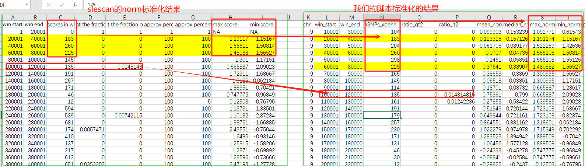

## sliding-window-for-xpehh-results
For normalizing and window statistics of XPEHH results.
对selscan计算的XPEHH结果进行标准化和滑窗统计。

## 查看帮助
输入文件--input（接selscan输出的.out文件）和--chr（接染色体号）是必选的；
窗口--window和步长--step默认是20000和10000，可以不写，或者根据自己的大小决定。

```sh
$ python xpehh2slidingWindow.py --help
usage: xpehh2slidingWindow.py [-h] --input INPUT [--window WINDOW] [--step STEP] --chr CHR

For normalizing and window statistics of XPEHH results. 

optional arguments:
  -h, --help       show this help message and exit
  --input INPUT    Input file (required, xpehh result)
  --window WINDOW  window size (default 20000)
  --step STEP      step size (default 10000)
  --chr CHR        Chromosome number (required, e.g., 10/chr10)
```

## 用法
例如对于selscan输出的chr8的“.out”结果，用下面的命令滑窗统计
Running command: 
```sh
python xpehh2slidingWindow.py --input popABD_popE.chr8.xpehh.out --window 20000 --step 10000 --chr 8
```
注意：selscan的结果是逐条染色体来处理的，这个脚本也是一次只能对一条染色体输出结果滑窗统计，处理哪条染色体你就给--chr加上那个染色体的号，不能写错染色体号，否则可能造成严重后果！！！如果想批量你就在linux下写个循环,批量处理所有染色体，例如下面这样：
```sh
for i in {1..20}; do python xpehh2slidingWindow.py --input popABD_popE.chr${i}.xpehh.out --window 20000 --step 10000 --chr $i; done
```
## 结果解读
    由于selscan的norm窗口统计不能滑窗统计，这里写一个连同标准化和滑窗统
    计一起做了，这里舍弃了原来norm的第7、8列的分位数的统计（不清楚目的，感觉没用就没加）。输出结果
    解读如下：
    chr: 染色体
    win_start:  窗口起始
    win_end: 窗口结束
    nSNPs: 窗口里的snp数量
    ratio_gt2: 大于标准化后normxpehh阈值2的标记占整个窗口的比例
    ratio_lt2: 小于于标准化后normxpehh阈值-2的标记占整个窗口的比例
    mean_normxpehh: 窗口内normxpehh均值
    median_normxpehh: 窗口内normxpehh中位数
    max_normxpehh: 窗口内normxpehh最大值
    min_normxpehh: 窗口内normxpehh最小值

#结果对比
可以看到脚本统计结果，跟selscan norm的结果对比，统一窗口的结果统计数值是相同的，只不过我们滑窗统计的，另外我们没有统计selscan norm的7、8列（不清楚目的，感觉没用就没加）。
另外我又加了一个窗口内norm_xpehh的均值、中位数、最大值和最小值这些，方便大家通过各种指标进行窗口的筛选。



# 声明
作者水平有限，统计完请仔细核对结果，上传到这里是方便部分朋友使用，本人不对结果可靠性负责，如果有建议或者发现错误请留言。
